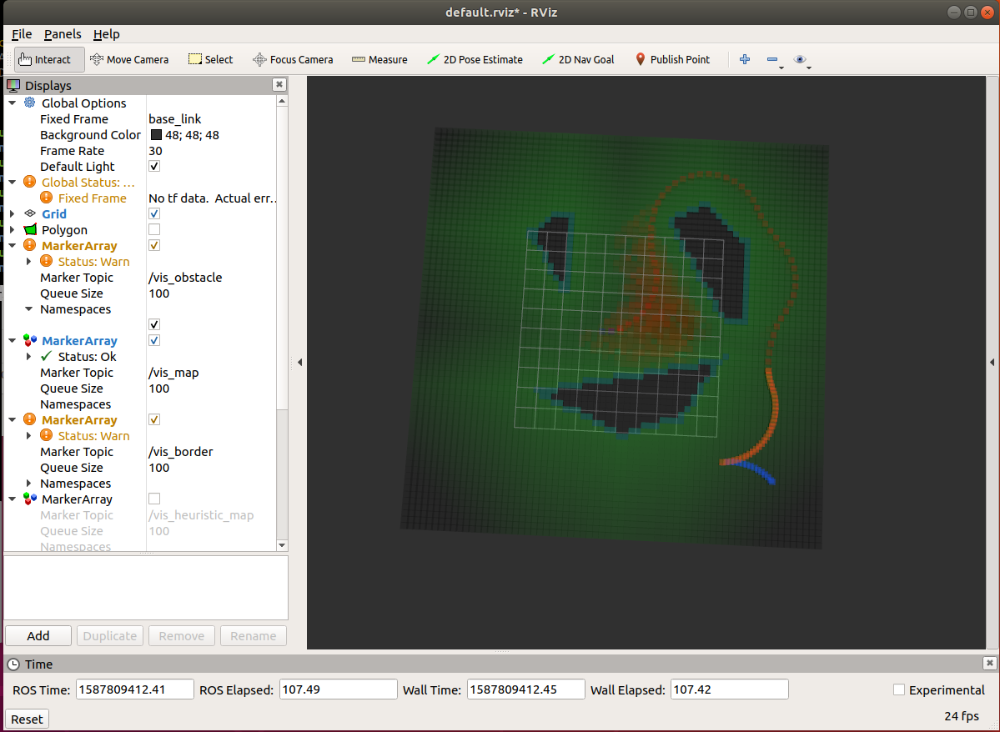

This Project is an implementation of "Path Planning for Autonomous Vehicles in Unknown Semi-structured Environments", Hybrid A* together with Reeds Shepp Path for open space trajectory searching. Some part of code refers to Baidu Apollo, including RS path param calculation.

Results:

The trajectory points contains two parts. The first part is generated by grid search using Hybrid A* from the start point, while the second part is generated by RS path leading to the destination.

#How to use
1. Clone the project to your_workspace/src.
2. Come back to your_workspace and catkin_make
3. source devel/setup.sh
4. roslaunch planner search.launch

parameters can be set in the launch file.
